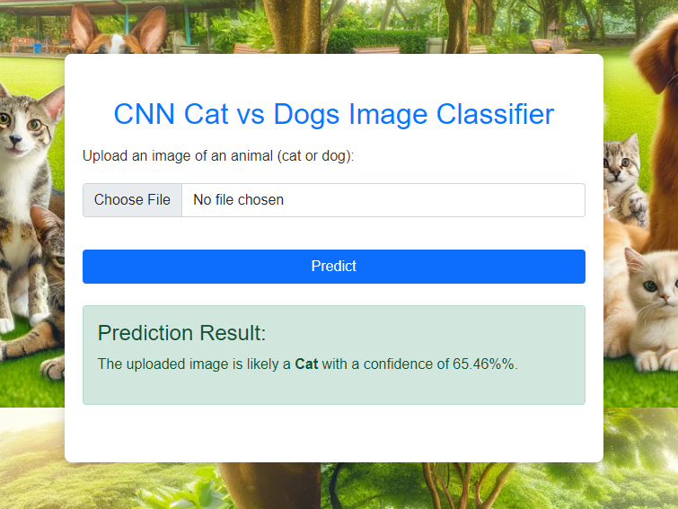
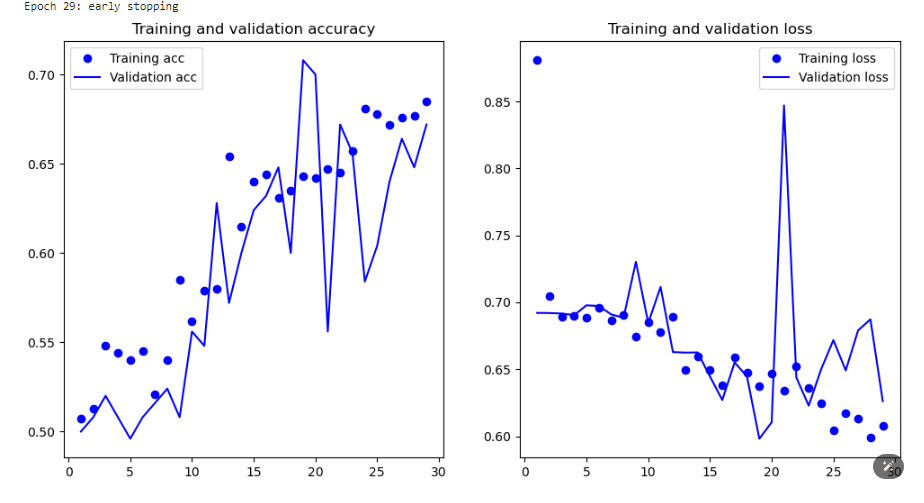
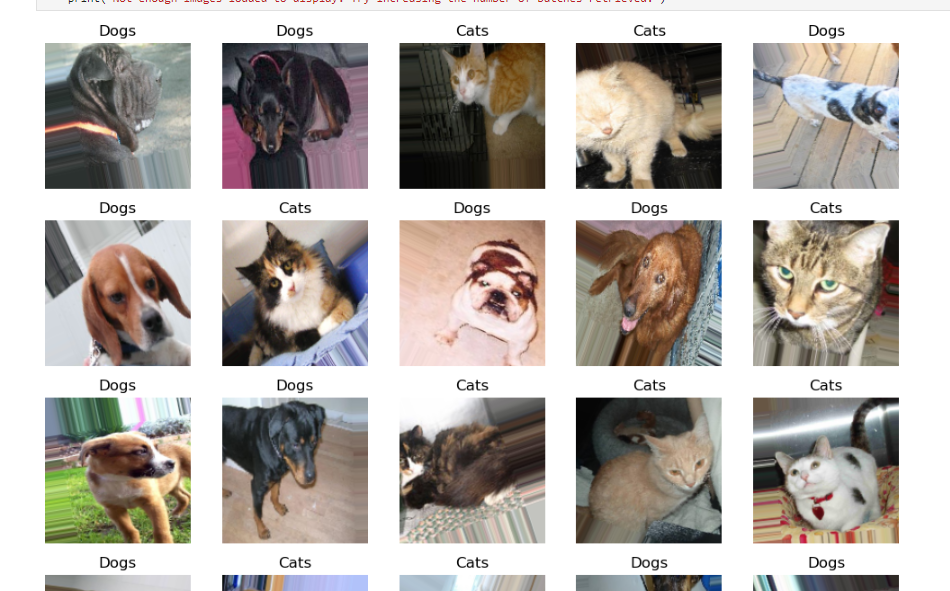

# CNN Cats vs Dogs Classifier



## Motivation
The motivation behind this project is to build an accurate and robust deep learning model to classify images of cats and dogs. This project aims to streamline the process of identifying and categorizing pet images, which can be beneficial for applications in pet adoption services, veterinary clinics, and automated photo management systems.
## Business Question
The primary business question addressed by this project is: "How can we leverage deep learning to automate and enhance the accuracy of classifying cat and dog images, thereby improving operational efficiency in pet-related industries and photo organization systems?"

## Why This Project?
This project demonstrates the power of Convolutional Neural Networks (CNNs) in image classification tasks. By developing a CNN-based classifier, we aim to showcase the effectiveness of deep learning models in distinguishing between two highly common and visually similar categories: cats and dogs.

## Results
The CNN model achieved significant results in classifying cats and dogs. Below are the key metrics visualized in the training history:



### Key Metrics:
- **Accuracy**: The model reached high accuracy levels on both training and validation datasets.
- **Loss**: The model's loss decreased consistently, indicating good learning progress.
- **Regularization**: The use of dropout layers and data augmentation helped in achieving satisfactory results by reducing overfitting.

## Running the Project
To run the project, follow these steps:

1. Clone the repository:
    ```sh
    git clone https://github.com/boss2256/CNN-Cats-Vs-Dogs.git
    cd CNN-Cats-Vs-Dogs
    ```

2. Install the required dependencies:
    ```sh
    pip install -r requirements.txt
    ```

3. Run the application:
    ```sh
    cd Cats-vs-Dogs-App
    flask run
    ```


## Technical Details
The system is built using the following steps:

1. **Check for GPU Availability**: Ensure that TensorFlow can utilize CUDA for GPU acceleration.
    ```python
    import tensorflow as tf
    print("TensorFlow version:", tf.__version__)
    print("Is CUDA available:", tf.test.is_built_with_cuda())
    print("GPUs available:", tf.config.list_physical_devices('GPU'))
    ```

2. **Data Preparation**: Organize the dataset into training and testing directories and count the number of images in each class.
    ```python
    base_directory = 'Data'
    train_folder = 'train'
    test_folder = 'test'
    ```

3. **Data Augmentation and Generators**: Apply data augmentation to increase the diversity of the training data and set up data generators.
    ```python
    from tensorflow.keras.preprocessing.image import ImageDataGenerator
    train_datagen = ImageDataGenerator(
        rescale=1./255,
        rotation_range=40,
        width_shift_range=0.2,
        height_shift_range=0.2,
        shear_range=0.2,
        zoom_range=0.2,
        horizontal_flip=True,
        fill_mode='nearest'
    )
    test_datagen = ImageDataGenerator(rescale=1./255)
    ```

4. **Model Architecture**: Define the CNN model with convolutional, max-pooling, and dense layers.
    ```python
    from tensorflow.keras.models import Sequential
    from tensorflow.keras.layers import Conv2D, MaxPooling2D, Flatten, Dense, Dropout
    model = Sequential([
        Conv2D(32, (3,3), activation='relu', input_shape=(150, 150, 3)),
        MaxPooling2D(2, 2),
        Conv2D(64, (3,3), activation='relu'),
        MaxPooling2D(2, 2),
        Conv2D(128, (3,3), activation='relu'),
        MaxPooling2D(2, 2),
        Conv2D(128, (3,3), activation='relu'),
        MaxPooling2D(2, 2),
        Flatten(),
        Dense(512, activation='relu'),
        Dropout(0.5),
        Dense(2, activation='softmax')
    ])
    ```

5. **Compile the Model**: Compile the model using the RMSprop optimizer.
    ```python
    from tensorflow.keras.optimizers import RMSprop
    model.compile(loss='categorical_crossentropy',
                  optimizer=RMSprop(learning_rate=0.001),
                  metrics=['accuracy'])
    ```

6. **Train the Model**: Train the model with early stopping to prevent overfitting.
    ```python
    from tensorflow.keras.callbacks import EarlyStopping
    early_stopping = EarlyStopping(monitor='val_loss', patience=10, restore_best_weights=True)
    history = model.fit(train_generator, epochs=30, validation_data=test_generator, callbacks=[early_stopping])
    ```

7. **Evaluate and Save the Model**: Evaluate the model's performance and save it for future use.
    ```python
    model.save('cats_dogs_classifier_model.h5')
    ```

8. **Load and Predict**: Load the saved model and use it to make predictions on new images.
    ```python
    from tensorflow.keras.models import load_model
    model = load_model('cats_dogs_classifier_model.h5')
    ```

## Conclusion
The CNN Cats vs Dogs classifier effectively differentiates between cats and dogs with high accuracy. The use of data augmentation, regularization techniques, and a well-structured CNN model contributed to the model's performance.

For more details on the model architecture, training process, and performance metrics, please refer to the `CNN_TrainingData.pdf` document included in this repository.
